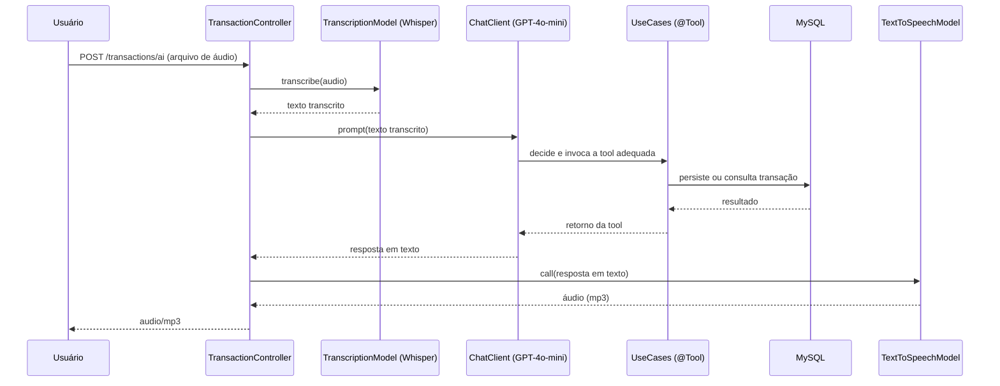

# 💰 API Inteligente de Controle de Gastos com Spring AI

Projeto final do **Bootcamp Santander Back-End Java com IA (DIO, 2026)**. Uma API REST que permite registrar e consultar gastos financeiros pessoais **usando a voz**: o usuário envia um áudio descrevendo uma despesa, a aplicação transcreve o áudio, interpreta a intenção com um LLM, executa a ação correspondente (persistir ou listar transações) e devolve a resposta também em áudio.

## 📌 Sobre o projeto

A ideia central é eliminar o atrito de preencher formulários para registrar gastos do dia a dia. Basta gravar um áudio como *"gastei 50 reais no mercado"* e a aplicação:

1. **Transcreve** o áudio para texto (Speech-to-Text);
2. **Interpreta** o texto com um modelo de linguagem (LLM), que decide qual ferramenta (*tool*) chamar;
3. **Executa** a ação de negócio (registrar uma nova transação ou listar transações por categoria);
4. **Sintetiza** a resposta do assistente em áudio (Text-to-Speech), devolvendo o resultado de forma natural.

O projeto foi desenvolvido de forma incremental, seção por seção, evoluindo de chamadas simples a modelos de IA até uma arquitetura DDD completa com persistência em banco de dados relacional.

## 🏗️ Arquitetura

O projeto segue uma organização inspirada em **Domain-Driven Design (DDD)**, separando claramente as responsabilidades entre domínio, aplicação e infraestrutura:

```
src/main/java/br/com/dio/dioprojetofinalbootcampsantanderjavaaibackend2026/
│
├── domain/                              # Núcleo do negócio (sem dependências externas)
│   ├── Transaction.java                 # Entidade de domínio da transação
│   ├── TransactionId.java               # Value Object (UUID) que identifica a transação
│   ├── Category.java                    # Enum de categorias de gasto
│   └── TransactionRepository.java       # Porta (interface) de persistência
│
├── application/                         # Casos de uso da aplicação
│   ├── PersistTransactionUseCase.java   # Caso de uso: registrar uma transação (@Tool)
│   ├── ListTransactionsByCategoryUseCase.java # Caso de uso: listar por categoria (@Tool)
│   ├── input/
│   │   └── PersistTransactionInput.java # DTO de entrada do caso de uso
│   └── output/
│       └── TransactionOutput.java       # DTO de saída do caso de uso
│
├── infrastructure/                      # Adaptadores (detalhes técnicos)
│   ├── http/
│   │   ├── TransactionController.java   # Endpoints REST (texto e voz)
│   │   ├── request/TransactionRequest.java
│   │   └── response/TransactionResponse.java
│   └── persistence/
│       ├── entity/TransactionEntity.java            # Entidade JPA
│       └── repository/
│           ├── JpaTransactionRepository.java        # Implementação da porta de domínio
│           └── TransactionEntityRepository.java     # Repositório Spring Data JPA
│
├── ChatClientController.java            # Endpoint de exploração do ChatClient (Spring AI)
├── ChatModelController.java             # Endpoint de exploração do ChatModel (Spring AI)
├── TranscriptionController.java         # Endpoint de exploração da Transcription API (STT)
├── TextToSpeechController.java          # Endpoint de exploração da Speech API (TTS)
└── DioProjetoFinalBootcampSantanderJavaAiBackend2026Application.java  # Classe principal
```

**Fluxo do endpoint principal (`POST /transactions/ai`):**



Os casos de uso `PersistTransactionUseCase` e `ListTransactionsByCategoryUseCase` são registrados como **tools** do Spring AI (`@Tool`) e injetados diretamente no `ChatClient`. É o próprio LLM, orientado por um *system prompt*, quem decide qual ferramenta chamar e com quais parâmetros, com base no texto transcrito do áudio.

## 🛠️ Tecnologias utilizadas

| Categoria | Tecnologia | Descrição |
|---|---|---|
| Linguagem | Java 25 | Versão da linguagem definida via toolchain no Gradle |
| Framework | Spring Boot 4.1.0 | Framework principal da aplicação |
| IA / LLM | Spring AI 2.0.0-M4 | Abstração para integração com modelos de IA |
| IA / LLM | OpenAI (`gpt-4o-mini`) | Modelo de linguagem usado para interpretar e responder |
| Voz → Texto | OpenAI Whisper (`whisper-1`) | Transcrição de áudio (Speech-to-Text) |
| Texto → Voz | OpenAI TTS (`gpt-4o-mini-tts`) | Síntese de voz (Text-to-Speech) |
| Persistência | Spring Data JPA | Camada de acesso a dados |
| Banco de dados | MySQL 9.6 | Banco relacional, executado via Docker |
| Build | Gradle | Gerenciador de build e dependências |
| Utilitário | Lombok | Redução de boilerplate (`@Data`, `@Getter`, etc.) |
| Infraestrutura | Docker Compose | Sobe o banco de dados automaticamente em ambiente de desenvolvimento |
| Testes | JUnit 5 + Spring Boot Test | Testes unitários e de integração |

## 🔌 Endpoints

### Transações

| Método | Endpoint | Descrição |
|---|---|---|
| `POST` | `/transactions` | Registra uma transação a partir de um JSON |
| `GET` | `/transactions/{category}` | Lista transações filtradas por categoria |
| `POST` | `/transactions/ai` | Registra ou consulta transações a partir de um **áudio**; responde em **áudio** |

#### `POST /transactions`

```bash
curl -X POST http://localhost:8080/transactions \
  -H "Content-Type: application/json" \
  -d '{
        "description": "Compras no mercado",
        "category": "GROCERIES",
        "amount": 5000
      }'
```

> `amount` é informado em **centavos** (ex.: `5000` = R$ 50,00).

#### `GET /transactions/{category}`

```bash
curl http://localhost:8080/transactions/GROCERIES
```

Categorias disponíveis: `GROCERIES`, `PHARMA`, `AUTO`.

#### `POST /transactions/ai` (fluxo por voz)

```bash
curl -X POST http://localhost:8080/transactions/ai \
  -F "file=@audio.m4a" \
  --output resposta.mp3
```

Envie um áudio dizendo algo como *"gastei 30 reais na farmácia"*; a resposta é um arquivo `resposta.mp3` com a confirmação falada pelo assistente.

### Exploração de IA (endpoints auxiliares)

| Método | Endpoint | Descrição |
|---|---|---|
| `GET` | `/api/chat-model?prompt=...` | Chamada direta ao `OpenAiChatModel` |
| `GET` | `/api/chat?prompt=...` | Chamada via `ChatClient` (com fluência/contexto) |
| `POST` | `/api/transcribe` (multipart `file`) | Transcreve um áudio isoladamente |
| `POST` | `/api/sinthesize` (JSON `{"text": "..."}`) | Sintetiza um texto em áudio (mp3) |

```bash
curl "http://localhost:8080/api/chat?prompt=Bom%20dia"
```

## ▶️ Como executar o projeto

### Pré-requisitos

- Java 25
- Docker e Docker Compose
- Uma chave de API da OpenAI

### Passo a passo

1. Clone o repositório:
```bash
git clone https://github.com/bartguitar/dio-projeto-final-bootcamp-santander-backend-java-ai-2026.git
cd dio-projeto-final-bootcamp-santander-backend-java-ai-2026
```

2. Defina a variável de ambiente com sua chave da OpenAI:
```bash
export OPENAI_API_KEY=sua-chave-aqui
```

3. Suba o banco de dados MySQL via Docker Compose (o Spring Boot também faz isso automaticamente ao iniciar, graças ao `spring-boot-docker-compose`):
```bash
docker compose up -d
```

4. Execute a aplicação:
```bash
./gradlew bootRun
```

A aplicação sobe em `http://localhost:8080` e o banco MySQL fica exposto na porta `3307`.

## 🗄️ Modelo de dados

A entidade `TransactionEntity` é persistida com as colunas:

| Campo | Tipo | Descrição |
|---|---|---|
| `id` | `UUID` | Identificador único da transação |
| `description` | `String` | Descrição do gasto |
| `amount` | `long` | Valor do gasto, em centavos |
| `category` | `Enum` (`GROCERIES`, `PHARMA`, `AUTO`) | Categoria do gasto |

O DDL é gerenciado automaticamente pelo Hibernate (`spring.jpa.hibernate.ddl-auto=update`).

## 🧠 Sobre o system prompt do assistente

O comportamento do assistente é orientado por um *system prompt* (`prompts/system-message.st`) que instrui o LLM a atuar como um assistente financeiro, extraindo dados de transações do texto transcrito e escolhendo a categoria mais adequada ao contexto antes de invocar as *tools* disponíveis.

## 🚀 Melhorias implementadas

Esta seção documenta as evoluções feitas sobre o projeto base do bootcamp, à medida que são implementadas.

### Melhoria A — Novos tipos de consulta financeira

Adiciona a possibilidade de consultar o **total gasto** em uma categoria durante um mês específico, tanto via REST quanto por voz.

**O que mudou:**

- **A.2 — Rastreio temporal:** a entidade `Transaction` passou a registrar `createdAt` (data/hora de criação), habilitando consultas por período. Persistido automaticamente no MySQL via `ddl-auto=update`.
- **A.1 — Endpoint de somatório:** novo endpoint `GET /transactions/summary`, que retorna o total gasto e a quantidade de transações de uma categoria em um mês.
- **A.3 — Tool de IA:** o assistente de voz agora pode responder perguntas como *"quanto eu gastei em farmácia esse mês?"* diretamente, sem precisar consultar o endpoint manualmente.

#### `GET /transactions/summary`

| Parâmetro | Tipo | Descrição |
|---|---|---|
| `category` | `GROCERIES` \| `PHARMA` \| `AUTO` | Categoria a ser somada |
| `month` | `String` (formato `AAAA-MM`) | Mês de referência |

```bash
curl "http://localhost:8080/transactions/summary?category=GROCERIES&month=2026-07"
```

**Resposta:**
```json
{
  "category": "GROCERIES",
  "month": "2026-07",
  "total": 120.00,
  "count": 4
}
```

#### Tool `sum-transactions-by-category`

Registrada no `ChatClient` do assistente, junto às demais ferramentas (`persist-transaction`, `list-transactions-by-category`). Basta enviar um áudio perguntando o total gasto em uma categoria/mês, via `POST /transactions/ai`, que o assistente decide sozinho quando usá-la — em vez de listar as transações uma a uma.

### Melhoria B — Melhorar as respostas da IA

Ajustes de configuração (sem novos endpoints) para tornar as respostas do assistente mais previsíveis e adequadas ao formato de áudio.

**O que mudou:**

- **B.1 — Prompt estruturado:** o `system-message.st` passou a orientar explicitamente o formato da resposta final do assistente, com exemplos literais de frase para cada tipo de ação (registro e consulta), além de uma instrução para nunca inventar valores ou categorias quando a fala do usuário for ambígua.
- **B.2 — Temperature baixa:** adicionada a configuração `spring.ai.openai.chat.options.temperature=0.2`, reduzindo a variação criativa nas respostas — importante para um

### Melhoria C — Novas *tools* de Tool Calling

Expande as ações que o assistente (por voz ou texto) consegue executar sobre uma transação, indo além de registrar e listar: agora também é possível corrigir e excluir dados, e consultar por período sem depender de categoria.

**O que mudou:**

- **C.1 — Excluir transação:** nova tool `delete-transaction` e endpoint `DELETE /transactions/{id}`, para remover um lançamento feito por engano.
- **C.2 — Corrigir categoria:** nova tool `update-transaction-category` e endpoint `PATCH /transactions/{id}/category`, para corrigir a classificação de uma transação já registrada sem precisar apagá-la e recriá-la.
- **C.3 — Consultar por período:** nova tool `list-transactions-by-period` e endpoint `GET /transactions?start=...&end=...`, para listar todas as transações de qualquer categoria dentro de um intervalo de datas.

#### `DELETE /transactions/{id}`

```bash
curl -X DELETE http://localhost:8080/transactions/3fa85f64-5717-4562-b3fc-2c963f66afa6
```
Retorna `204 No Content` em caso de sucesso.

#### `PATCH /transactions/{id}/category`

```bash
curl -X PATCH http://localhost:8080/transactions/3fa85f64-5717-4562-b3fc-2c963f66afa6/category \
  -H "Content-Type: application/json" \
  -d '"PHARMA"'
```

#### `GET /transactions?start={AAAA-MM-DD}&end={AAAA-MM-DD}`

```bash
curl "http://localhost:8080/transactions?start=2026-07-01&end=2026-07-31"
```

#### Tools de IA

As três ações acima também estão disponíveis para o assistente de voz via `POST /transactions/ai`, registradas no `ChatClient` junto às demais ferramentas:

| Tool | Função |
|---|---|
| `delete-transaction` | Exclui uma transação pelo identificador |
| `update-transaction-category` | Corrige a categoria de uma transação já registrada |
| `list-transactions-by-period` | Lista transações de qualquer categoria dentro de um intervalo de datas |

> A exclusão e a correção de categoria por voz funcionam melhor quando o identificador da transação está disponível no contexto recente da conversa (por exemplo, logo após o assistente registrar ou listar a transação) — o usuário não costuma saber o UUID de cor.

### Melhoria D — Validações antes de salvar uma transação

Impede que dado inválido entre no sistema, usando validação automática do Spring (Bean Validation) em todos os pontos de entrada — tanto na criação de transação via REST quanto via assistente de voz — além de um tratamento central de erros que padroniza as respostas quando algo é inválido ou não é encontrado.

**O que mudou:**

- **Validação na porta REST:** `TransactionRequest` passou a exigir descrição não vazia, categoria informada e valor positivo. Requisições inválidas são recusadas antes de chegar à camada de aplicação.
- **Validação na porta de IA:** `PersistTransactionInput` recebeu as mesmas regras, validadas manualmente dentro de `PersistTransactionUseCase` — garantindo que uma transcrição de áudio ambígua não gere uma transação inconsistente.
- **Tratamento de identificador inválido:** os endpoints `DELETE /transactions/{id}` e `PATCH /transactions/{id}/category` passaram a receber `UUID` em vez de `String` no path, rejeitando automaticamente qualquer id mal formatado.
- **Tratamento de identificador inexistente:** criada a exceção de domínio `TransactionNotFoundException`, lançada quando um id válido não corresponde a nenhuma transação salva.
- **`GlobalExceptionHandler`:** centraliza a tradução de todas essas exceções em respostas HTTP padronizadas, no formato [`ProblemDetail`](https://datatracker.ietf.org/doc/html/rfc9457) (RFC 9457), com status code e mensagem apropriados — em vez de stacktraces expostos ao cliente.

**Antes:**
> Uma transação com descrição vazia era salva normalmente. Um id inexistente ou mal formatado gerava um erro 500 genérico.

**Depois:**

| Cenário | Status | Resposta |
|---|---|---|
| Descrição vazia ou valor ≤ 0 | `400 Bad Request` | JSON com a lista de campos inválidos |
| Id em formato inválido (não-UUID) | `400 Bad Request` | JSON informando o parâmetro inválido |
| Id válido, mas transação inexistente | `404 Not Found` | JSON com a mensagem "Transação não encontrada" |
| Dado inválido vindo do assistente de voz | `400 Bad Request` | JSON com o detalhe da violação |

```bash
curl -i -X POST http://localhost:8080/transactions -H "Content-Type: application/json" \
  -d '{"description": "", "category": "GROCERIES", "amount": -10}'
```

```json
{
  "type": "about:blank",
  "title": "Dados inválidos",
  "status": 400,
  "errors": [
    "description: A descrição é obrigatória",
    "amount: O valor deve ser maior que zero"
  ]
}
```

Essa melhoria não adiciona endpoints novos — o efeito é observado como uma camada de proteção sobre os endpoints já existentes (`POST /transactions`, `DELETE /transactions/{id}`, `PATCH /transactions/{id}/category`) e sobre o fluxo de voz (`POST /transactions/ai`).

### Melhoria E — Melhorar os endpoints REST

Refina os endpoints de listagem e criação para seguir boas práticas REST, sem adicionar funcionalidade de negócio nova.

**O que mudou:**

- **E.1 — Paginação:** os endpoints `GET /transactions/{category}` e `GET /transactions?start&end` deixaram de retornar todas as transações de uma vez e passaram a aceitar `page` e `size` na query string, devolvendo um `Page` com metadados (total de itens, total de páginas, etc.). A tool de IA correspondente (`list-transactions-by-period`) continua listando sem exigir paginação do LLM, usando internamente a primeira página com tamanho fixo.
- **E.2 — `Location` header:** `POST /transactions` passou a retornar o header `Location`, apontando para a URL do recurso recém-criado, seguindo a convenção REST para respostas `201 Created`.
- **E.3 — Ordenação:** os mesmos endpoints paginados aceitam o parâmetro `sort`, permitindo ordenar o resultado por qualquer campo (ex.: valor, data de criação), inclusive com múltiplos critérios.

#### `GET /transactions/{category}`

| Parâmetro | Tipo | Descrição |
|---|---|---|
| `page` | `int` (padrão `0`) | Número da página |
| `size` | `int` (padrão `20`) | Quantidade de itens por página |
| `sort` | `String` | Campo e direção de ordenação (ex.: `amount,desc`) |

```bash
curl "http://localhost:8080/transactions/GROCERIES?page=0&size=5&sort=amount,desc"
```

#### `GET /transactions?start={AAAA-MM-DD}&end={AAAA-MM-DD}`

```bash
curl "http://localhost:8080/transactions?start=2026-07-01&end=2026-07-31&page=0&size=10&sort=createdAt,desc"
```

#### `POST /transactions`

```bash
curl -i -X POST http://localhost:8080/transactions -H "Content-Type: application/json" \
  -d '{"description":"Compras no mercado","category":"GROCERIES","amount":5000}'
```

**Resposta:**
```
HTTP/1.1 201 Created
Location: http://localhost:8080/transactions/3fa85f64-5717-4562-b3fc-2c963f66afa6
Content-Type: application/json

{
  "id": "3fa85f64-5717-4562-b3fc-2c963f66afa6",
  "category": "GROCERIES",
  "description": "Compras no mercado",
  "amount": 50.00
}
```
### Melhoria F — Testes dos fluxos principais

Adiciona cobertura de testes automatizados para a lógica mais sensível do projeto — validação de dados e regras de negócio — complementando os testes de integração de IA que já existiam (`*IT.java`, dependentes de `OPENAI_API_KEY`). O foco aqui é o oposto: testes **rápidos, determinísticos e isolados**, que rodam em qualquer máquina ou pipeline de CI sem precisar de banco de dados real nem de chave de API.

#### Estratégia de testes

O projeto passa a ter duas camadas de teste, com propósitos diferentes:

| Camada | Exemplo | Depende de | Quando roda |
|---|---|---|---|
| Testes de integração de IA (já existentes) | `ToolCallingIT`, `OpenAiChatClientIT` | `OPENAI_API_KEY`, rede | Sob demanda, ambiente com credenciais |
| **Testes unitários e de controller (Melhoria F)** | `PersistTransactionUseCaseTest`, `TransactionControllerTest` | Nada externo (tudo mockado) | Toda execução de `./gradlew test`, inclusive CI |

Essa separação segue a lógica da **pirâmide de testes**: a maior parte da cobertura vem de testes rápidos e isolados (unitários), enquanto os testes de integração — mais lentos e caros — ficam reservados para validar a integração real com serviços externos.

#### F.1 — Testes unitários dos use cases

Usam **JUnit 5 + Mockito**, simulando o `TransactionRepository` (interface de domínio) para testar a regra de negócio isoladamente, sem tocar em banco de dados.

| Classe de teste | Casos cobertos |
|---|---|
| `PersistTransactionUseCaseTest` | Persistência de transação válida; rejeição de descrição vazia; rejeição de valor negativo |
| `DeleteTransactionUseCaseTest` | Exclusão de transação existente; exceção ao excluir transação inexistente |
| `UpdateTransactionCategoryUseCaseTest` | Atualização de categoria válida; exceção ao atualizar transação inexistente |

Exemplo representativo (`PersistTransactionUseCaseTest`):

```java
@Test
void deveRejeitarTransacaoComValorNegativo() {
    var input = new PersistTransactionInput("Mercado", -100, Category.GROCERIES);

    assertThatThrownBy(() -> useCase.execute(input))
            .isInstanceOf(ConstraintViolationException.class);
}
```

O `Validator` usado nesses testes é a implementação real do Jakarta Validation (não mockada) — garantindo que as anotações `@NotBlank`/`@Positive` (Melhoria D) sejam exercitadas de verdade, e não simuladas.

#### F.2 — Testes do controller REST

Usam `@WebMvcTest` + `MockMvc`, que sobem **só a camada web** (controller, validação de `@RequestBody` e `GlobalExceptionHandler`), sem subir o contexto Spring completo nem conexão com banco — todas as dependências do `TransactionController` (use cases e os três beans de IA) são substituídas por `@MockitoBean`.

| Cenário testado | Verificação |
|---|---|
| Criação de transação válida | `201 Created`, presença do header `Location`, corpo com os dados persistidos |
| Criação de transação inválida | `400 Bad Request`, corpo com lista de campos inválidos |
| Exclusão de transação inexistente | `404 Not Found` |
| Identificador em formato inválido (não-UUID) | `400 Bad Request` |

Exemplo representativo (`TransactionControllerTest`):

```java
@Test
void deveCriarTransacaoComSucesso() throws Exception {
    var output = new TransactionOutput("123", "Mercado", "GROCERIES", 50.0);
    when(persistTransactionUseCase.execute(any())).thenReturn(output);

    mockMvc.perform(post("/transactions")
                    .contentType(MediaType.APPLICATION_JSON)
                    .content("""
                            {"description": "Mercado", "category": "GROCERIES", "amount": 5000}
                            """))
            .andExpect(status().isCreated())
            .andExpect(header().exists("Location"))
            .andExpect(jsonPath("$.description").value("Mercado"));
}
```

#### Por que essa cobertura, e não outra

Os testes concentram-se deliberadamente nos fluxos que mais mudaram nas melhorias anteriores:

- **Validação de dados** (Melhoria D) — garante que descrição vazia, valor negativo ou categoria ausente continuem sendo rejeitados, tanto pela porta REST quanto pela porta de tool calling, à medida que o código evolui.
- **Tratamento de erros** (`GlobalExceptionHandler`) — garante que identificadores inválidos ou inexistentes continuem retornando respostas HTTP padronizadas (`400`/`404`), em vez de stacktraces.

Ficaram fora do escopo (por decisão consciente, priorizando um conjunto pequeno e funcional): testes de paginação/ordenação (Melhoria E), testes de exclusão/edição bem-sucedida via `MockMvc` e testes end-to-end do fluxo de voz completo — esse último já é parcialmente coberto pelos testes de integração de IA existentes no projeto.

#### Como rodar

```bash
# Roda toda a suíte de testes
./gradlew test

# Roda só os testes desta melhoria
./gradlew test --tests "*PersistTransactionUseCaseTest" \
                --tests "*DeleteTransactionUseCaseTest" \
                --tests "*UpdateTransactionCategoryUseCaseTest" \
                --tests "*TransactionControllerTest"
```

Diferente dos testes `*IT.java` (que exigem `OPENAI_API_KEY` configurada), os testes desta melhoria rodam de forma totalmente isolada — o que os torna adequados para rodar automaticamente em um pipeline de CI, a cada push, sem necessidade de segredos ou credenciais externas.

## 🎓 Aprendizados do módulo

Este projeto foi construído de forma incremental ao longo do bootcamp, cobrindo:

- Integração do Spring Boot com Spring AI e a API da OpenAI;
- Diferença entre `ChatModel` (chamada direta) e `ChatClient` (fluente, com contexto e *tools*);
- **Tool Calling**: como expor métodos Java como ferramentas que um LLM pode decidir invocar;
- Integração com **Transcription API** (Speech-to-Text) e **Speech API** (Text-to-Speech) da OpenAI;
- Orquestração de um fluxo completo de IA: áudio → texto → decisão do LLM → ação de negócio → áudio;
- Aplicação de conceitos de **DDD** (domínio, aplicação e infraestrutura) em uma API Spring Boot;
- Persistência com Spring Data JPA e subida de infraestrutura local com Docker Compose.

## 👨‍🏫 Curso

Projeto desenvolvido como parte do **Bootcamp Santander Back-End Java com IA**, oferecido pela [DIO (Digital Innovation One)](https://www.dio.me/).

## 👤 Autor

Desenvolvido por [**Adriel**](https://github.com/bartguitar).
