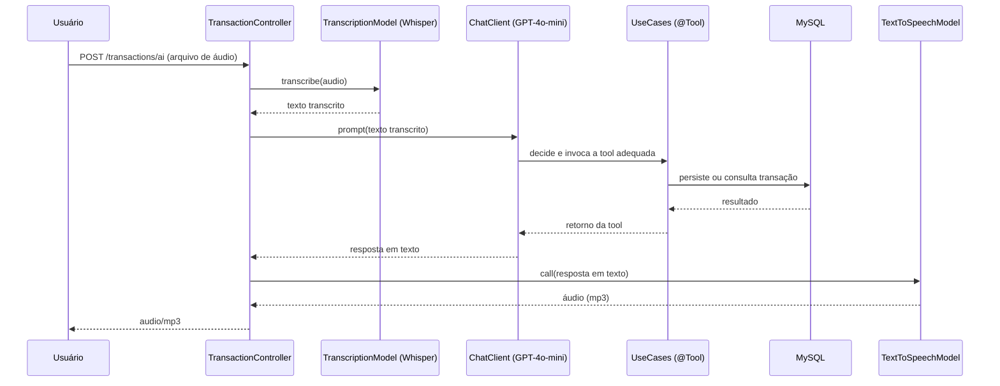

# 💰 API Inteligente de Controle de Gastos com Spring AI

Projeto final do **Bootcamp Santander Back-End Java com IA (DIO, 2026)**. Uma API REST que permite registrar e consultar gastos financeiros pessoais **usando a voz**: o usuário envia um áudio descrevendo uma despesa, a aplicação transcreve o áudio, interpreta a intenção com um LLM, executa a ação correspondente (persistir ou listar transações) e devolve a resposta também em áudio.

## 📌 Sobre o projeto

A ideia central é eliminar o atrito de preencher formulários para registrar gastos do dia a dia. Basta gravar um áudio como *"gastei 50 reais no mercado"* e a aplicação:

1. **Transcreve** o áudio para texto (Speech-to-Text);
2. **Interpreta** o texto com um modelo de linguagem (LLM), que decide qual ferramenta (*tool*) chamar;
3. **Executa** a ação de negócio (registrar uma nova transação ou listar transações por categoria);
4. **Sintetiza** a resposta do assistente em áudio (Text-to-Speech), devolvendo o resultado de forma natural.

O projeto foi desenvolvido de forma incremental, seção por seção, evoluindo de chamadas simples a modelos de IA até uma arquitetura DDD completa com persistência em banco de dados relacional.

## 🏗️ Arquitetura

O projeto segue uma organização inspirada em **Domain-Driven Design (DDD)**, separando claramente as responsabilidades entre domínio, aplicação e infraestrutura:

```
src/main/java/br/com/dio/dioprojetofinalbootcampsantanderjavaaibackend2026/
│
├── domain/                              # Núcleo do negócio (sem dependências externas)
│   ├── Transaction.java                 # Entidade de domínio da transação
│   ├── TransactionId.java               # Value Object (UUID) que identifica a transação
│   ├── Category.java                    # Enum de categorias de gasto
│   └── TransactionRepository.java       # Porta (interface) de persistência
│
├── application/                         # Casos de uso da aplicação
│   ├── PersistTransactionUseCase.java   # Caso de uso: registrar uma transação (@Tool)
│   ├── ListTransactionsByCategoryUseCase.java # Caso de uso: listar por categoria (@Tool)
│   ├── input/
│   │   └── PersistTransactionInput.java # DTO de entrada do caso de uso
│   └── output/
│       └── TransactionOutput.java       # DTO de saída do caso de uso
│
├── infrastructure/                      # Adaptadores (detalhes técnicos)
│   ├── http/
│   │   ├── TransactionController.java   # Endpoints REST (texto e voz)
│   │   ├── request/TransactionRequest.java
│   │   └── response/TransactionResponse.java
│   └── persistence/
│       ├── entity/TransactionEntity.java            # Entidade JPA
│       └── repository/
│           ├── JpaTransactionRepository.java        # Implementação da porta de domínio
│           └── TransactionEntityRepository.java     # Repositório Spring Data JPA
│
├── ChatClientController.java            # Endpoint de exploração do ChatClient (Spring AI)
├── ChatModelController.java             # Endpoint de exploração do ChatModel (Spring AI)
├── TranscriptionController.java         # Endpoint de exploração da Transcription API (STT)
├── TextToSpeechController.java          # Endpoint de exploração da Speech API (TTS)
└── DioProjetoFinalBootcampSantanderJavaAiBackend2026Application.java  # Classe principal
```

**Fluxo do endpoint principal (`POST /transactions/ai`):**



Os casos de uso `PersistTransactionUseCase` e `ListTransactionsByCategoryUseCase` são registrados como **tools** do Spring AI (`@Tool`) e injetados diretamente no `ChatClient`. É o próprio LLM, orientado por um *system prompt*, quem decide qual ferramenta chamar e com quais parâmetros, com base no texto transcrito do áudio.

## 🛠️ Tecnologias utilizadas

| Categoria | Tecnologia | Descrição |
|---|---|---|
| Linguagem | Java 25 | Versão da linguagem definida via toolchain no Gradle |
| Framework | Spring Boot 4.1.0 | Framework principal da aplicação |
| IA / LLM | Spring AI 2.0.0-M4 | Abstração para integração com modelos de IA |
| IA / LLM | OpenAI (`gpt-4o-mini`) | Modelo de linguagem usado para interpretar e responder |
| Voz → Texto | OpenAI Whisper (`whisper-1`) | Transcrição de áudio (Speech-to-Text) |
| Texto → Voz | OpenAI TTS (`gpt-4o-mini-tts`) | Síntese de voz (Text-to-Speech) |
| Persistência | Spring Data JPA | Camada de acesso a dados |
| Banco de dados | MySQL 9.6 | Banco relacional, executado via Docker |
| Build | Gradle | Gerenciador de build e dependências |
| Utilitário | Lombok | Redução de boilerplate (`@Data`, `@Getter`, etc.) |
| Infraestrutura | Docker Compose | Sobe o banco de dados automaticamente em ambiente de desenvolvimento |
| Testes | JUnit 5 + Spring Boot Test | Testes unitários e de integração |

## 🔌 Endpoints

### Transações

| Método | Endpoint | Descrição |
|---|---|---|
| `POST` | `/transactions` | Registra uma transação a partir de um JSON |
| `GET` | `/transactions/{category}` | Lista transações filtradas por categoria |
| `POST` | `/transactions/ai` | Registra ou consulta transações a partir de um **áudio**; responde em **áudio** |

#### `POST /transactions`

```bash
curl -X POST http://localhost:8080/transactions \
  -H "Content-Type: application/json" \
  -d '{
        "description": "Compras no mercado",
        "category": "GROCERIES",
        "amount": 5000
      }'
```

> `amount` é informado em **centavos** (ex.: `5000` = R$ 50,00).

#### `GET /transactions/{category}`

```bash
curl http://localhost:8080/transactions/GROCERIES
```

Categorias disponíveis: `GROCERIES`, `PHARMA`, `AUTO`.

#### `POST /transactions/ai` (fluxo por voz)

```bash
curl -X POST http://localhost:8080/transactions/ai \
  -F "file=@audio.m4a" \
  --output resposta.mp3
```

Envie um áudio dizendo algo como *"gastei 30 reais na farmácia"*; a resposta é um arquivo `resposta.mp3` com a confirmação falada pelo assistente.

### Exploração de IA (endpoints auxiliares)

| Método | Endpoint | Descrição |
|---|---|---|
| `GET` | `/api/chat-model?prompt=...` | Chamada direta ao `OpenAiChatModel` |
| `GET` | `/api/chat?prompt=...` | Chamada via `ChatClient` (com fluência/contexto) |
| `POST` | `/api/transcribe` (multipart `file`) | Transcreve um áudio isoladamente |
| `POST` | `/api/sinthesize` (JSON `{"text": "..."}`) | Sintetiza um texto em áudio (mp3) |

```bash
curl "http://localhost:8080/api/chat?prompt=Bom%20dia"
```

## ▶️ Como executar o projeto

### Pré-requisitos

- Java 25
- Docker e Docker Compose
- Uma chave de API da OpenAI

### Passo a passo

1. Clone o repositório:
```bash
git clone https://github.com/bartguitar/dio-projeto-final-bootcamp-santander-backend-java-ai-2026.git
cd dio-projeto-final-bootcamp-santander-backend-java-ai-2026
```

2. Defina a variável de ambiente com sua chave da OpenAI:
```bash
export OPENAI_API_KEY=sua-chave-aqui
```

3. Suba o banco de dados MySQL via Docker Compose (o Spring Boot também faz isso automaticamente ao iniciar, graças ao `spring-boot-docker-compose`):
```bash
docker compose up -d
```

4. Execute a aplicação:
```bash
./gradlew bootRun
```

A aplicação sobe em `http://localhost:8080` e o banco MySQL fica exposto na porta `3307`.

## 🗄️ Modelo de dados

A entidade `TransactionEntity` é persistida com as colunas:

| Campo | Tipo | Descrição |
|---|---|---|
| `id` | `UUID` | Identificador único da transação |
| `description` | `String` | Descrição do gasto |
| `amount` | `long` | Valor do gasto, em centavos |
| `category` | `Enum` (`GROCERIES`, `PHARMA`, `AUTO`) | Categoria do gasto |

O DDL é gerenciado automaticamente pelo Hibernate (`spring.jpa.hibernate.ddl-auto=update`).

## 🧠 Sobre o system prompt do assistente

O comportamento do assistente é orientado por um *system prompt* (`prompts/system-message.st`) que instrui o LLM a atuar como um assistente financeiro, extraindo dados de transações do texto transcrito e escolhendo a categoria mais adequada ao contexto antes de invocar as *tools* disponíveis.

## 🚀 Melhorias implementadas

Esta seção documenta as evoluções feitas sobre o projeto base do bootcamp, à medida que são implementadas.

### Melhoria A — Novos tipos de consulta financeira

Adiciona a possibilidade de consultar o **total gasto** em uma categoria durante um mês específico, tanto via REST quanto por voz.

**O que mudou:**

- **A.2 — Rastreio temporal:** a entidade `Transaction` passou a registrar `createdAt` (data/hora de criação), habilitando consultas por período. Persistido automaticamente no MySQL via `ddl-auto=update`.
- **A.1 — Endpoint de somatório:** novo endpoint `GET /transactions/summary`, que retorna o total gasto e a quantidade de transações de uma categoria em um mês.
- **A.3 — Tool de IA:** o assistente de voz agora pode responder perguntas como *"quanto eu gastei em farmácia esse mês?"* diretamente, sem precisar consultar o endpoint manualmente.

#### `GET /transactions/summary`

| Parâmetro | Tipo | Descrição |
|---|---|---|
| `category` | `GROCERIES` \| `PHARMA` \| `AUTO` | Categoria a ser somada |
| `month` | `String` (formato `AAAA-MM`) | Mês de referência |

```bash
curl "http://localhost:8080/transactions/summary?category=GROCERIES&month=2026-07"
```

**Resposta:**
```json
{
  "category": "GROCERIES",
  "month": "2026-07",
  "total": 120.00,
  "count": 4
}
```

#### Tool `sum-transactions-by-category`

Registrada no `ChatClient` do assistente, junto às demais ferramentas (`persist-transaction`, `list-transactions-by-category`). Basta enviar um áudio perguntando o total gasto em uma categoria/mês, via `POST /transactions/ai`, que o assistente decide sozinho quando usá-la — em vez de listar as transações uma a uma.

## 🎓 Aprendizados do módulo

Este projeto foi construído de forma incremental ao longo do bootcamp, cobrindo:

- Integração do Spring Boot com Spring AI e a API da OpenAI;
- Diferença entre `ChatModel` (chamada direta) e `ChatClient` (fluente, com contexto e *tools*);
- **Tool Calling**: como expor métodos Java como ferramentas que um LLM pode decidir invocar;
- Integração com **Transcription API** (Speech-to-Text) e **Speech API** (Text-to-Speech) da OpenAI;
- Orquestração de um fluxo completo de IA: áudio → texto → decisão do LLM → ação de negócio → áudio;
- Aplicação de conceitos de **DDD** (domínio, aplicação e infraestrutura) em uma API Spring Boot;
- Persistência com Spring Data JPA e subida de infraestrutura local com Docker Compose.

## 👨‍🏫 Curso

Projeto desenvolvido como parte do **Bootcamp Santander Back-End Java com IA**, oferecido pela [DIO (Digital Innovation One)](https://www.dio.me/).

## 👤 Autor

Desenvolvido por [**Adriel**](https://github.com/bartguitar).
